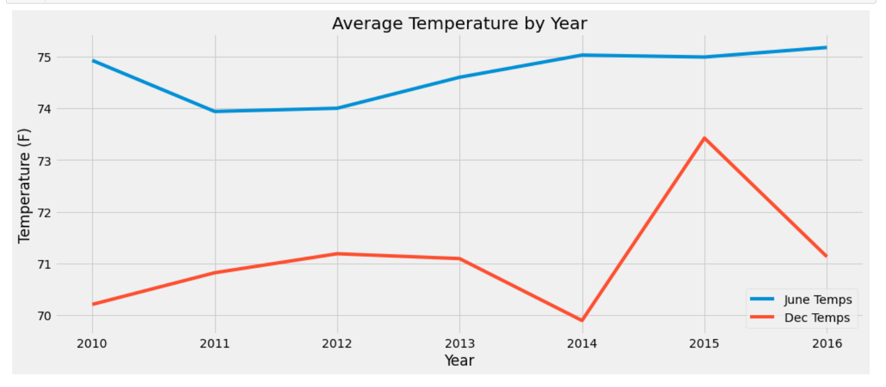
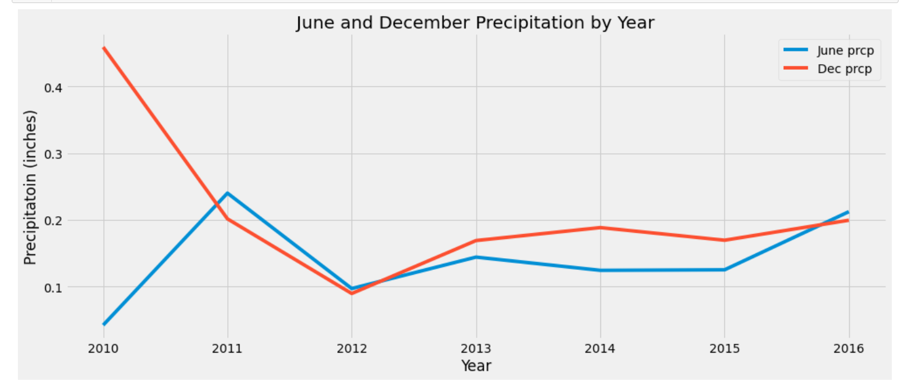

# surfs_up

### **Objectives**

The objective of this project is to study the impact of weather on the investment in a _Surf n' Shake_ shop that will serve surf boards and sell ice cream to the locals and tourists in Oahu, Hawaii. The study is made to convince a wealthy investor, W. Avy to invest money in the shop. In the past, Mr. Avy invested in a surf shop that went out of business because of too much rain. Mr. Avy does not want to open a shop in a region that is too cold or too much rain that will make a _surf n' ice cream_ shop unsustainable. He asked for a weather analysis so that he knows that the weather would not be an issue in running this new business. We are provided with eight years of weather data in a SQLite database that includes date, weather station id, temperature and precipitations data collected by those stations. We used SQLAlchemy and Pandas Jupyter notebook to import, manipulate and extract the useful weather data. 

### **Purpose**

The purpose of the project is to learn the use of SQLite and SQLAlchemy. SQLAlchemy is a querry tool that allows us to access SQLite databases. We are given the data in a SQLite file, _hawaii.sqlite_. We imported pandas, numpy, matplotlib for data manipulation using Pandas in Jupyter notebook. We also imported SQLAlchemy dependencies such as *automap_base*, _session_, *create_engine*, _func_, _extract_. SQLAlchemy has a feature, *ORM* (Object Relational Mapper) that allowed us to create classes in our code that decoupled the data in  _hawaii.sqlite_ and allowed us to map the weather tables data in a jupyter notebook file. 

### **Analysis**

The weather data is given in a sqlite file, _hawaii.sqlite_. We used _Pandas_ to import the files and manipulate data that can be presented in a user friendly format. We used **_Automap Base_** to create a base class automap for an automap schema. This created the foundation to build on in SQLAlchemy. We transformed data tables to create classes that helped keep the code decoupled. There are two tables in the _hawaii.sqlite_ database - _measurement_ and _station_. We created classes to reference each table using a code. For the deliverables of this project we used the code: "*Measurement = Base.classes.measurement*" to access the _measurement_ table. We wrote query statements to extract information from the Measurement data. Finally we created a DataFrame and and obtained the summary statistics. We focused on the temperature data for June and December in Oahu as requested by Mr. W. Avy.

#### **Deliverable 1: Extract temperature data for June**

We are provided with eight years (2010 - 2017) of weather data in a SQLite file. We extracted the daily temperature observation (_tobs_) data taken by different weather stations throughout the year and filtered the data for June. After creating a dataframe we calculated a summary statistics as shown in Fig 1 below. The data shows the average June temperature is close to the median temperature. The temperature is not skewed, while there are hot days (85 $^\circ$ maximum) and cold days (64 $^\circ$ ). There is not much variation in the temperature. A cold day of 64 $^\circ$ is unusual for June. This could be an error in reading by one weather station, or it could also be an unusally cold summer day in one year. We need to investigate this more. 

**Fig 1.** The figure shows the summary statistics from the June temperature data.

#### **Deliverable 2: Extract temperature data for December**

We filtered the data for December from the seven years (2010 - 2016). There is no data from December on 2017. We filtered the data for December the same way we filtered the data for June. The summary statistics is shown in Fig 2. The mean and the median temperature is almost the same again. The temperature is not skewed. There are some unusual temperature reading, such as 83 $^\circ$ in December. This could be due to an error or this could be a hot day in December. 

**Fig 2.** The figure shows the summary statistics from the December temperature data.

### **Further Analysis of Temperature and Precipitation Data for June and December**

The investor, W. Avy is concerned about opening a surf and ice cream shop that could not sustain due to weather condition. Temperatures and precipitations fluctuate during a month. The average temperatuer in Deliverable 1 and 2 shows that there is not much fluctuation of average temperature at either time of the year. I calculated the monthly average temperature in June and December for each year. After merging the data with _'inner-join'_, the average June and December temperature for each year is plotted in Fig 3. June temperature looks almost flat, while December temperature has more fluctuation. December 2015 looks warmer than other years. A warmer temperature would be better for selling ice cream and surfing. However, I wanted to see if there was an unusual amount of rain that year. Too much rain would deter people from going outdoors. I focused on Decmeber 2015 data:  filtered it and took the average of daily temperature data recorded by different weather stations. The 2015 December data is plotted in Fig 4. December 2015 seems to be an unusually warmer month. The precipitation information is shown below.

**Fig 3.** The figure shows average temperature of June and December for seven years. 

**Fig 4.** Daily temperture for the month of December, 2015. 

Precipitation is also a concern for W. Avy since a previous surf shop went of business due to rain. I calculated average precipitation for June and December for seven years and plotted it in Fig 5. It looks like December 2010 was too wet, while June had less than usual amount of rain. I also studied the December 2015 precipitation. The result is shown in Fig 6. 

**Fig 5.** Average monthly precipitation for July and December for seven years. 

**Fig 6.** December 2015 precipitation data from daily average precipitation recorded by different weather station. 

### **Conclusion**

W. Avy wanted to know the temperature trend for June and December from the data he provided us. The analysis shows that the average temperature is mostly stable in Oahu, while summer is a couple of degrees warmer than winter as expected. The summary of Deliverables 1 and 2 are given below.

- **Deliverable 1**: The average June temperature is 74.94 $^\circ$  with a standard deviation of 3.26 $^\circ$. The median temperature is 75.00 $^\circ$. The plot in Fig 3 shows that the June temperature is stable and the small variation should not be an issue for the _Surf n' Shake_ shop.

- **Deliverable 2**: The average December temperature is 71.04 $^\circ$ with a standard deviation of 3.75 $^\circ$ . The median temperature is 71.00 $^\circ$ . The temperature is stable for most of the time near 71 $^\circ$ . 

- **Comparing June and December Temperature Data**: The temperature in June is usually stable. The upper (75%) and lower (25%) quartile of June temperature are 73.00 $^\circ$ and 77 $^\circ$ respectively. This two degrees spread is very small to have a temperature related issue with keeping the shop opened. The December temperature has more spread compared to June. The upper and lower quartiles are 74.00 $^\circ$ and 69.00 $^\circ$ repectively. A five degrees of temperature spread should not be an issue for the shop. 

**Futher Study:** Mr. W. Avy is concerened about the temperature effect on opening the _Surf n' Shake_ shop. The temperature seems to be stable in Oahu. Another factor that needs to be considered is the precipitation in Oahu. I looked at the June and December precipation. The precipitation is not too much for most years in June and December. More precipitation study needs to be done, especially since W. Avy's first ice cream shop venture failed due to too much rain in that area. Other months of the year could have more rain. As we studied the data (not asked in the deliverables) we found that there was 6.70 inches of rain during one of the days between Aug 24, 2016 and Aug 23, 2017. A scatter plot of all the precipitation vs. temperature data would give a summary of the variations of each month that might effect the success of the business. Within the scatter plot, a low temperature or high precipitation would result in days of low customer activities.